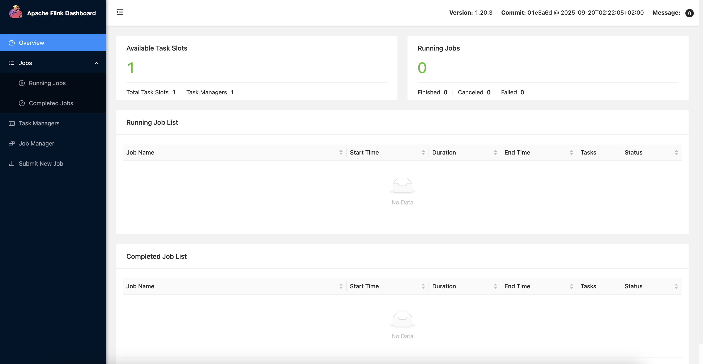
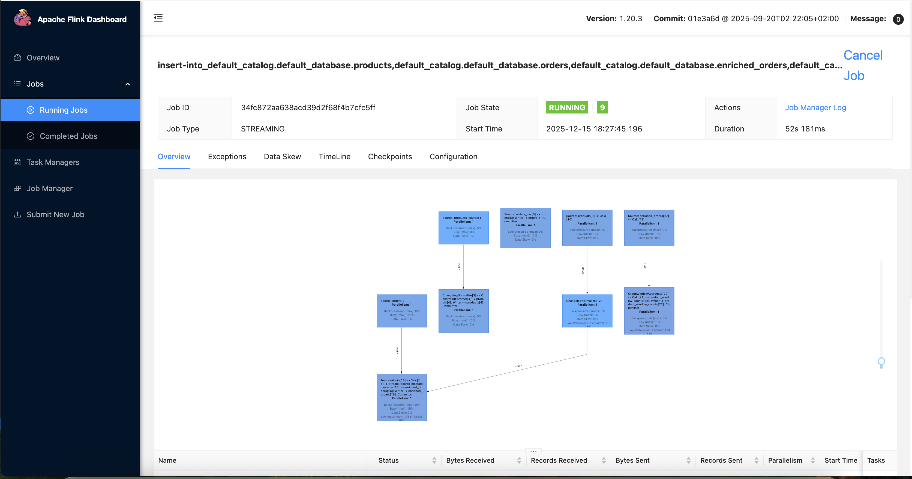
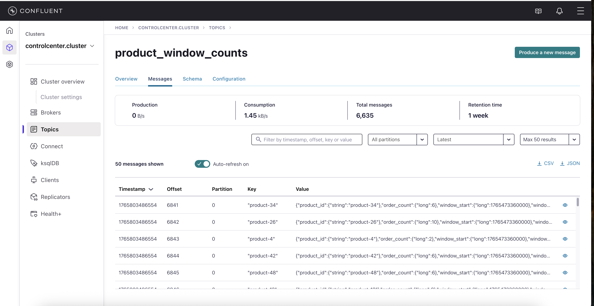

# E-commerce use case with Apache Flink 

## Overview
This repo walks you through an e-commerce use case, enriching real-time order and products streams, performing windowed aggregation to count every products order count per window interval with Open Source Flink. This repo will give you step by step guide on how to run this use case end-to-end.

## Prerequisites
- Kafka & Schema Registry clusters
- Python
- Open Source Flink
- Java 11
- Maven

## Architecture


This architecure involves:
- Reading `Order` CSV files from a local folder and stream rows as new events to Kafka topic using Flink FileStream Connector.
- Streaming CDC changes from `Product` table on the Postgres Database to a Kafka topic using Flink Postgres CDC connector.
- Materializes Product table.
- Orders and Products tables are joined using Flink's Temporal Join to enrich in real-time.
- Perform Windowed aggregation to count each product's order for every window interval.

## Requirements
- Access
  - Kafka and Schema Registry clusters</br>
    There are different ways in which you can spin up a Kafka cluster.
    - Confluent Cloud Account Access - https://cnfl.io/getstarted
    - Confluent Platform with Kubernetes setup - https://docs.confluent.io/operator/current/co-deploy-cfk.html</br>
    Once the Kafka cluster is up and running create topics named `products`, `products_materialized`, `orders`, `enriched_orders` and `product_window_counts` with `1` partition. 
  - Postgres Database 

- Local Software Requirements:
  - [Python UV package manager](https://pypi.org/project/uv/)
  - [Apache Flink Standalone software (Version 1.20.3)](https://dlcdn.apache.org/flink/flink-1.20.3/flink-1.20.3-bin-scala_2.12.tgz)
  - [Java 11](https://www.oracle.com/in/java/technologies/javase/jdk11-archive-downloads.html)
  - [Apache Maven](https://maven.apache.org/download.cgi)

Clone this repository to your local machine
```
git clone https://github.com/RakeshNKundar/cp_flink_ecommerce_usecase.git
```

## Quick Start

### Step 1: Download and Install Apache Flink software
  Download the Apache Flink software by following the link on the Requirements section. This will download the software to your local machine. Untar the file and add the `bin/` folder to your system `PATH` variable to run flink command. You can follow the below command if you are using MAC device.

  ```
  sudo vi ~/.zshrc
  
  -- Add the below line at the end of the file
  export PATH=$PATH:<ABSOLUTE_PATH_WHERE_FLINK_IS_DOWNLOADED>/flink-1.20.3/bin
  ```

  Run the below `flink` command to verify the installation
  ```
  flink --version
  ```
  You should get the below output if flink is setup successfully.
  ```
  Version: 1.20.3, Commit ID: 01e3a6d
  ```

### Step 2: Create a Postgres DB and create products table.
You can create a managed postgres DB on AWS RDS with public facing endpoints. Makes sure you enable `replication_factor=1` in the database parameter group while creating the DB for CDC connector to stream events from the transaction logs. Once created run the below command to create a `product` table under `postgres` database and `public` schema. 

```
create table products(
product_id VARCHAR PRIMARY KEY,
product_name VARCHAR,
stock INT,
last_updated_ts TIMESTAMP(3)
);
```


### Step 3: Setup the .env file and generate Flink dependency JARS.
Go to the directory where you have cloned this Github repo. Follow the instructions to setup the working directory to make it ready for Flink deployment.

To download the python dependency library, RUN the below command. This will create a python virtual environment and install all the dependent python libraries.
```
uv sync

# Activate the virtual environment
source .venv/bin/activate

# Create directories to write CSV Zip and extracted files
mkdir csv_files
chmod 777 csv_files

```

In the `.env` file, pass in the values for `Kafka`, `Schema Registry` and `Postgres DB` endpoints and credentials for the Flink job and internal scripts to write events. Only update the below variables on the `.env` file.
```
SCHEMA_REGISTRY_URL=<SCHEMA_REGISTRY_ENDPOINT>
KAFKA_BOOTSTRAP_SERVERS=<KAFKA_BOOTSTRAP_SERVER_ADDRESSS>
POSTGRES_HOST=<POSTGRES_DB_ENDPOINT>
POSTGRES_USERNAME=<POSTGRES_USERNAME>
POSTGRES_PASSWORD=<POSTGRES_PASSWORD>
POSTGRES_DATABASE=<POSTGRES_DATABASE_NAME>
POSTGRES_SCHEMA=<POSTGRES_DATABASE_SCHEMA>
``` 

Flink job requires certain JAR files to execute which has be downloaded upfront and is passed during the compile time. We will use `MAVEN` to download these JARS without any hassle. Make sure you have `MAVEN` installed on your machine and follow the below commands

```
# Change to the maven Directory
cd maven

# Run the maven command to install JAR files
mvn clean package
```

### Step 4: Start a local Flink cluster
Before running a Flink Job, you need to start a local Flink cluster on your laptop/VM. You can run a standalone Flink cluster with `1` task slot which can be used for simple Flink job.

```
# Navigate to the directory where Flink 1.20.3 is downloaded
cd <ABSOLUTE_PATH_WHERE_FLINK_IS_DOWNLOADED>/flink-1.20.3/bin

# Run the below command to start a Flink cluster
./start-cluster.sh
```
This will start a standalone deamon cluster on your localhost machine.

On your browser type the URL `http://localhost:8081/#/overview` to view the Flink Web Dashboard. You should see something similart to the below image.



### Step 5: Submit a Flink Job to the local Flink cluster
So, We have our Flink standalone cluster running, The next step is to compile your Flink job and submit it to the Flink cluster. We will use the `flink` CLI to perform this operation.

```
flink run -py postgres_cdc_flink_job.py
```

This command will give you a Job ID. Copy it somewhere which will be useful while tearing down the setup.

You can open the URL `http://localhost:8081/#/overview` and under Running jobs, You will see your Flink job similar to the image below



### Step 6: Run the script files to generate MOCK order and product source events.
There are few scripts in your current working directory built to generate mock events for both sources like `Products` and `Orders`. 

`Product` mock events will be written to `Products` table on the Postgres DB by taking the credentials from the `.env` file. Execute the command which will generate/update product event on the PG table. Execute this on a new terminal as a separate process

```
python3 products_producer.py
```

For `orders` mock events, The `orders_producer_zip.py` file will generate a zip file containing `3` CSV files with each CSV file containing `1` order event every second to `zipped_files` directory. `unzip_CSV_file.py` file reads ZIP files in `zipped_files` directory and unzips it and writes every CSV file to `csv_files` directory.

```
# Run the script to watch zip files on a new terminal
python3 unzip_CSV_file.py

# Writes Orders Zip file mock generator - Run this on a new terminal
python3 orders_producer_zip.py
```

You should see events flowing to kafka topics like shown in the below image.



### Step 7: [Optional] - Deploy this Flink Job on CP Flink.
Follow the [CP for Apache Flink - Packaging and Deployment](https://docs.confluent.io/platform/current/flink/jobs/applications/packaging.html) to package this Flink Job and deploy it to Flink kubernetes cluster. 

**Note**: You should write the CSV events to some external filesystem(As this setup writes to a local directory) for Flink Job to work seamlessly.

### Step 8: Teardown.
Before destorying all resources, Stop all the python script processes generating mock data.

Stop the flink job by running the below command inside your working directory. Use the Flink job id you received while executing the `flink run` command. 
```
flink stop -p . <FLINK_JOB_ID>
```

Stop the local Standalone flink cluster.
```
cd <ABSOLUTE_PATH_WHERE_FLINK_IS_DOWNLOADED>/flink-1.20.3/bin

# To stop the Flink cluster
./stop-cluster.sh
```

