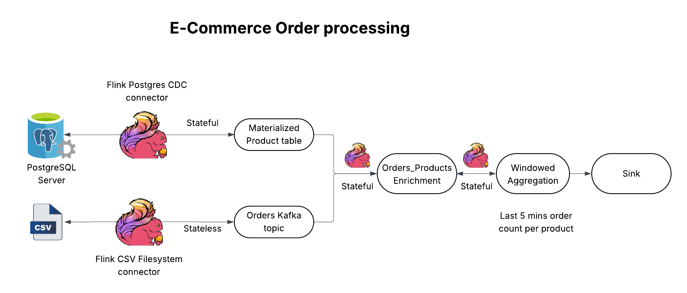

# E-commerce use case with Apache Flink 

## Overview
This repo walks you through an e-commerce use case, enriching real-time order and products streams, performing windowed aggregation to count every products order count per window interval with Open Source Flink. This repo with gives you step by step guide to run this use case end-to-end.

## Prerequisites
- Kafka & Schema Registry clusters
- Python
- Open Source Flink
- Java
- Maven

## Architecture



This architecure involves:
- Reading `Order` CSV files from a local folder and stream rows as new events to Kafka topic using Flink FileStream Connector.
- Streaming CDC changes from `Product` table on the Postgres Database to a Kafka topic using Flink Postgres CDC connector.
- Materializes Product table.
- Orders and Products tables are joined using Flink's Temporal Join to enrich in real-time.
- Perform Windowed aggregation to count each product's order for every window interval.

## Requirements
- Access
  - Kafka and Schema Registry clusters</br><br>
    There are different ways in which you can spin up a Kafka cluster.
    - Confluent Cloud Account Access - https://cnfl.io/getstarted
    - Confluent Platform with Kubernetes setup - https://docs.confluent.io/operator/current/co-deploy-cfk.html
  - Postgres Database 

- Local Software Requirements:
  - [Python UV package manager](https://pypi.org/project/uv/)
  - [Apache Flink Standalone software (Version 1.20.3)](https://dlcdn.apache.org/flink/flink-1.20.3/flink-1.20.3-bin-scala_2.12.tgz)
  - [Java 11]
  - [Apache Maven](https://maven.apache.org/download.cgi)

Clone this repository to your local machine
```
git clone https://github.com/RakeshNKundar/cp_flink_ecommerce_usecase.git
```

## Quick Start

### Step 1: Download and Install Apache Flink software
  Download the Apache Flink software by following the link on the Requirements section. This will download the software to your local machine. Untar the file and add the `bin/` folder to your system `PATH` variable to run flink command. You can follow the below command if you are using MAC device.

  ```
  sudo vi ~/.zshrc
  
  -- Add the below line at the end of the file
  export PATH=$PATH:<ABSOLUTE_PATH_WHERE_FLINK_IS_DOWNLOADED>/flink-1.20.3/bin
  ```

  Run the below `flink` command to verify the installation
  ```
  flink --version
  ```
  You should get the below output if flink is setup successfully.
  ```
  Version: 1.20.3, Commit ID: 01e3a6d
  ```

### Step 2: Setup the .env file and generate Flink dependency JARS.


### Step 3: Start a local Flink cluster


### Step 4: Submit a Flink Job to the local Flink cluster


### Step 5: Run the script files to generate MOCK order and product source events.


### Step 6: 